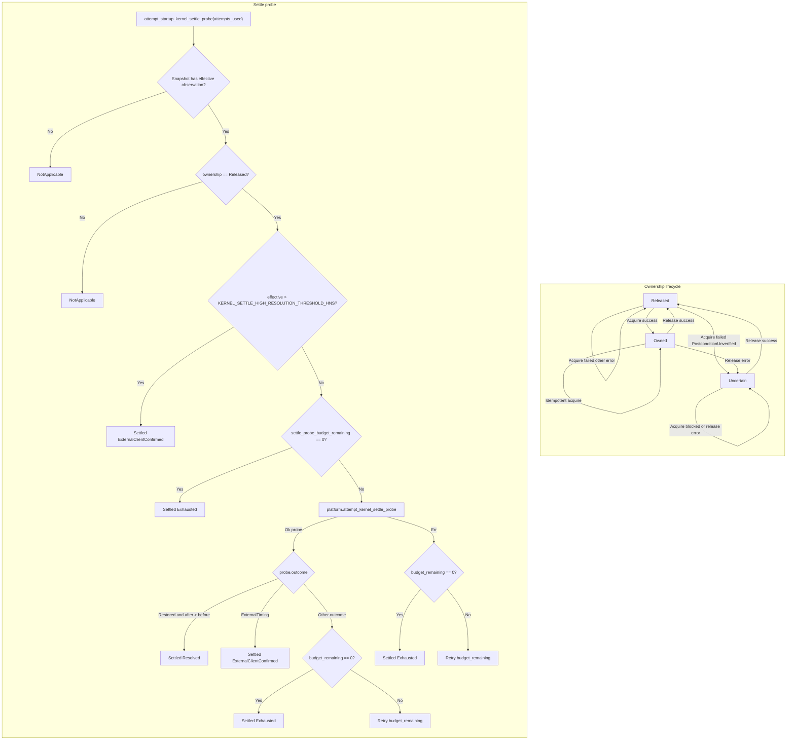

# tick-ownership lib architecture

Source: `crates/tick-ownership/src/lib.rs`

## Notes

* Startup controller assumes zero prior ownership and starts in Released state
* Controller only records explicit successful requests and never writes guessed global defaults
* Acquire preflights the resolved interval then requests the timer resolution
* If acquire fails with PostconditionUnverified ownership transitions to Uncertain
* Non postcondition acquisition errors keep ownership in Released state
* Release requires active or uncertain ownership and calls platform release
* Successful release transitions state to Released and establishes release boundary
* Release handoff observation queries use the existing boundary without resolving new intervals
* Failed release leaves ownership tracked and marks verification as Unverified
* Settle probe runs only when ownership is Released and effective snapshot exists
* Settle probe budget allows at most three attempts spaced by caller timing
* Coarser resolution after restorative probe proves an orphaned token was dropped
