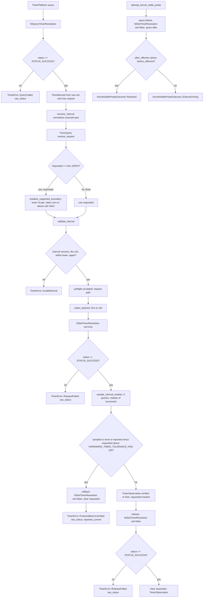

# tick-platform-windows lib.rs

Source path: `crates/tick-platform-windows/src/lib.rs`

## Notes

- `TimerBounds.minimum_interval` holds the API minimum-resolution output and `maximum_interval` holds the maximum-resolution output. The labels are not used as an ordering guarantee because the observed pair can arrive reversed.
- `numeric_interval` sorts the pair numerically so `lower` is the smallest hns value, which is the finest resolution the hardware reports.
- Automatic selection triggers when `requested == Hns::ZERO` and picks `smallest_supported_boundary`, rejecting a zero lower bound or a value above `u32::MAX` with `TimerError::InvalidInterval`.
- `validate_interval` rejects zero, values above `u32::MAX`, and anything outside the normalized `lower..upper` pair.
- `HARDWARE_TIMER_TOLERANCE_HNS` is 100 hns. `is_satisfied` accepts `reported_current <= requested` or an overshoot within tolerance, while `effective_relation` reports finer, equal, satisfied, or unverified.
- `sample_interval_median` issues up to `VERIFICATION_SAMPLE_COUNT` (3) queries, returns `None` when fewer than two succeed, prefers the in-tolerance sample on exactly two successes, and otherwise takes `median_of_three`.
- On postcondition failure the request path rolls back with `NtSetTimerResolution` set=false, clears `self.requested`, and returns `TimerError::PostconditionUnverified`.
- `NtStatus` is `i32` and `STATUS_SUCCESS` is 0. Every non-zero status maps to `QueryFailed`, `RequestFailed`, or `ReleaseFailed` carrying the raw code, preserving negative codes such as `STATUS_TIMER_RESOLUTION_NOT_SET`.
- `NtBoolean` is `u8` and `nt_boolean` maps true to 1 and false to 0 for the `set_resolution` argument.
- `release` logs a restorative release when the tracked `requested` interval is missing or mismatched, then calls `apply_release_outcome` which clears tracking only on success.
- `attempt_kernel_settle_probe` queries before and after a set=false call and reports `Restored` only when `after_effective > before_effective`.
- On non-Windows targets every trait method logs unsupported and returns `TimerError::Unsupported`. Native calls sit behind `#[cfg(windows)]` and `#[link(name = "ntdll")]`.
