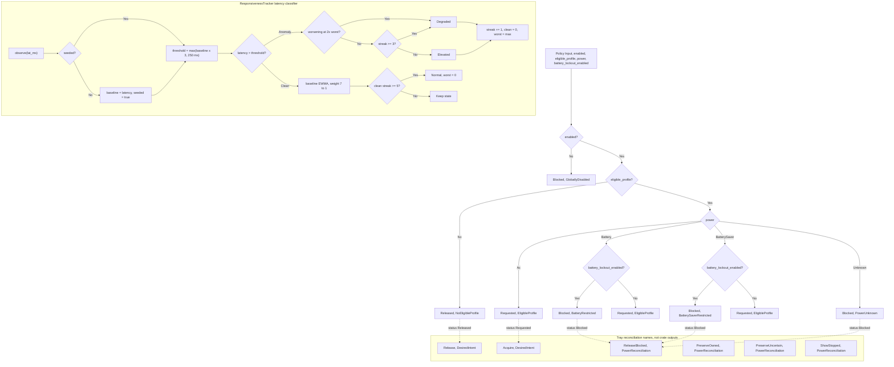

# tick-policy lib architecture

Source: `crates/tick-policy/src/lib.rs`

## Notes

* This crate is pure decision logic only, it never observes platform state
* decide evaluates guards in a fixed order, global disable first
* A disabled policy always returns Blocked with GloballyDisabled
* No eligible profile returns Released with NoEligibleProfile
* Ac power returns Requested with EligibleProfile
* Battery and BatterySaver honor battery_lockout_enabled, enabled gives Blocked and disabled gives Requested
* Unknown power is conservatively Blocked with PowerUnknown
* The raw statuses inside decide are Blocked, Released and Requested
* Acquire, Release, ReleaseBlocked, PreserveOwned, PreserveUncertain and ShowStopped are tray layer names, they are not produced by this crate
* The anomaly threshold is the larger of 3 times the baseline and 250 ms
* One anomalous sample gives Elevated, three consecutive samples or a 2x episode worst gives Degraded
* A clean sample moves the baseline with a 7 to 1 EWMA and five clean samples recover Normal