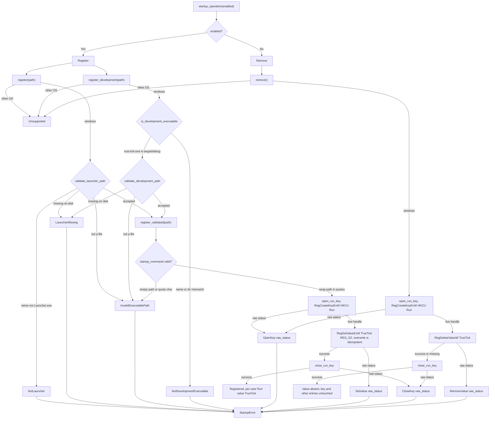

# tick-startup-windows lib architecture

Source: `crates/tick-startup-windows/src/lib.rs`

## Notes

* Scope is the current user HKCU Run key only
* No service, scheduled task, machine-wide value, installer, or elevated state is created
* startup_operation maps enabled true to Register and false to Remove
* register requires the file name Launcher.exe, then checks existence and file type
* register_development requires true-tick.exe plus target and debug path components
* Non Windows targets return Unsupported for register, register_development, and remove
* startup_command wraps the path in double quotes so paths with spaces still launch
* Empty paths and paths containing a double quote return InvalidExecutablePath
* RegSetValueExW writes a REG_SZ value named TrueTick, an existing value is overwritten so the set is idempotent
* remove treats ERROR_SUCCESS and ERROR_FILE_NOT_FOUND alike, so a missing value counts as success
* Rollback is non destructive, only the TrueTick value is removed and the Run key and other entries stay
* Raw Win32 status codes are captured in OpenKey, SetValue, RemoveValue, and CloseKey variants, and tests exercise pure helpers only
