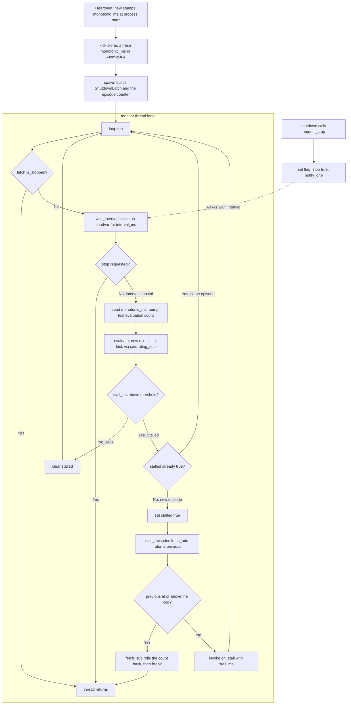

# tick-watchdog lib architecture

Source: `crates/tick-watchdog/src/lib.rs`

## Notes

* HEARTBEAT_INTERVAL_MS is 1000 ms and STALL_THRESHOLD_MS is 4000 ms, giving a 4x stall margin
* MAX_STALL_EPISODES is 8 and caps the number of stall callbacks the monitor can invoke
* monotonic_ms reads Instant elapsed since PROCESS_EPOCH, initialized once with OnceLock, and saturates to u64::MAX if the conversion fails
* Heartbeat::new stamps the current count while kick stores a fresh count, both using Relaxed ordering
* evaluate computes now_ms minus last_kick_ms with saturating_sub so an older kick cannot underflow
* The verdict is Stalled only when stall_ms is strictly greater than stall_threshold_ms, equality stays Alive
* The monitor checks is_stopped before each wait, then blocks for the full interval unless a stop arrives
* wait_interval absorbs spurious wakeups by recomputing remaining time from Instant, and returns true the moment the stop flag is set
* request_stop sets the mutex flag first, then the atomic stop flag with Release ordering, then calls notify_one
* A stalled verdict sets the in loop stalled flag and calls fetch_add, repeated stalled verdicts in the same episode are skipped, and only an Alive verdict resets the flag
* Cap semantics, the counter is incremented before the check and rolled back with fetch_sub when the previous value is at or above the cap, then the loop breaks, so stall_episodes never exceeds MAX_STALL_EPISODES
* shutdown ends the thread without invoking the callback, so on_stall runs at most once per stall episode and never after the cap
